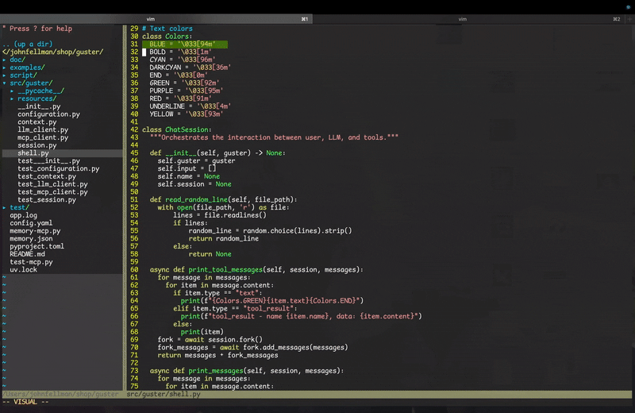
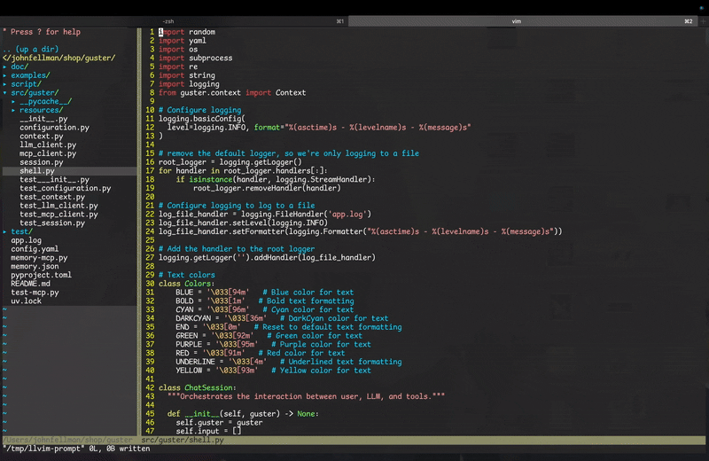
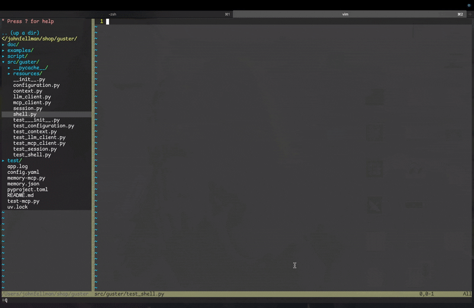

# LLviM
Local LLM Plugin for for a conversational coding workflow in VIM.

## Features
All demos at 2x speed.

- Rewrite code blocks with instructions:

- Chat in dedicated window that automatically copies generated code blocks into default and numbered registers:

- Control context by selecting text or executing in normal mode (to send all open files).

(Also had **llama.vim** running during this demo)

### Warning
Editing the buffer while generation is happening can cause unexpected behavior and crash vim. Open to suggestions on fixing this - the buffer must be modifiable to stream the generated results to it.
Also, only one vim session can be open at a time or the context buffers will collide. I'll fix this sooner than later.

Heavily copied from the precursor to [llama.vim](https://github.com/ggml-org/llama.vim).
(Also, intentionally does not conflict with **llama.vim**.)

## Setup
1. Install, build [llama.cpp](https://github.com/ggerganov/llama.cpp?tab=readme-ov-file#building-the-project), and run your favorite model (deepseek-coder is pretty cool).
  - can also use remote servers providing a compliant API.
2. Copy the llvim.vim file from this repo to `~/.vim/autoload/`
3. Copy the keybindings and variable below into your `~/.vimrc`
```vim
" llm endpoint - update if you're running on a different port or using a remote server
let g:llvim_api_url= "127.0.0.1:8080/completion"
" if you're using a remote server with authentication
let g:llvim_api_key= ""
autocmd BufWinEnter /tmp/llvim-prompt set syntax=markdown
" insert mode
inoremap <C-K> <Cmd>call llvim#doLlamaGen()<CR>
" normal mode
nnoremap <C-K> <Cmd>call llvim#doLlamaGen()<CR>
nnoremap <C-B> <Cmd>call llvim#openOrClosePromptBuffer()<CR>
"visual mode
vnoremap <C-K> <Cmd>call llvim#doLlamaGen()<CR>
```

### Compatible Models
- [deepseek-coder](https://huggingface.co/deepseek-ai/DeepSeek-Coder-V2-Lite-Instruct)
    - this surprisingly works well with **llama.vim**
- [ggml-org's quantized Qwen models](https://huggingface.co/collections/ggml-org/llamavim-6720fece33898ac10544ecf9)
  - these work great for both **llama.vim** and **LLviM**

## Usage
First, you must have a running llama server. It can be local or remote, just set an accurate url in the `g:llvim_api_url` var in your `~/.vimrc`.

The plugin operates by calling the llama server with the context you provide via a prompt buffer and any open files (depending on what mode you are in).

### When Editing a File
`CTRL-B` opens the prompt buffer, which writes a file to `/tmp/llama-prompt`.

`CTRL-K`:
- in `insert` mode, will send the current line and default register (last thing yanked) to be rewritten. Great for Deleting a block of code and giving instructions to rewrite or extend.
- in `visual` mode, will copy the selected lines to the context buffer and open it.
- in `normal` mode, will send the default register, the current line, and all open files as context, and insert at the cursor line. Like insert mode, but sends open files for extra context. Great for things like "rewrite this test like the others".

### The Context Buffer
`CTRL-B` closes the prompt buffer.
`CTRL-K`:
- in `insert` mode, will send the buffer up to and including the current line for generation.
- in `visual` mode, will send just the selected text for generation.
- in `normal` mode, will send the entire context buffer and all open files for generation. 

After every generation in the context buffer, all code blocks will be placed in the numbered regsitered in the order they appear in the buffer, and the last code block will also be placed in the default register.

### Overriding LLM Settings
(From original llama.cpp example script)
`g:llvim_api_url`, `g:llvim_api_key` and `g:llvim_overrides` can be configured in your .vimrc:
```vim
let g:llvim_api_url = "192.168.1.10:9000"
```

`llvim_overrides` can also be set through buffer/window scopes. For instance:
```vim
autocmd filetype python let `b:llvim_overrides` = {"temp": 0.2}
```
Could be added to your .vimrc to automatically set a lower temperature when editing a python script.


Additionally, an override dict can be stored at the top of a file:
```vim
!*{"stop": ["User:"]}
```
Could be added to the start of your chatlog.txt to set the stopping token.
These parameter dicts are merged together from lowest to highest priority:
server default -> `g:llvim_overrides` -> `w:llvim_overrides` -> `b:llvim_overrides` -> in file (!*) overrides

Sublists (like `logit_bias` and stop) are overridden, not merged
Example override:
```vim
!*{"logit_bias": [[13, -5], [2, false]], "temperature": 1, "top_k": 5, "top_p": 0.5, "n_predict": 256, "repeat_last_n": 256, "repeat_penalty": 1.17647}
```
